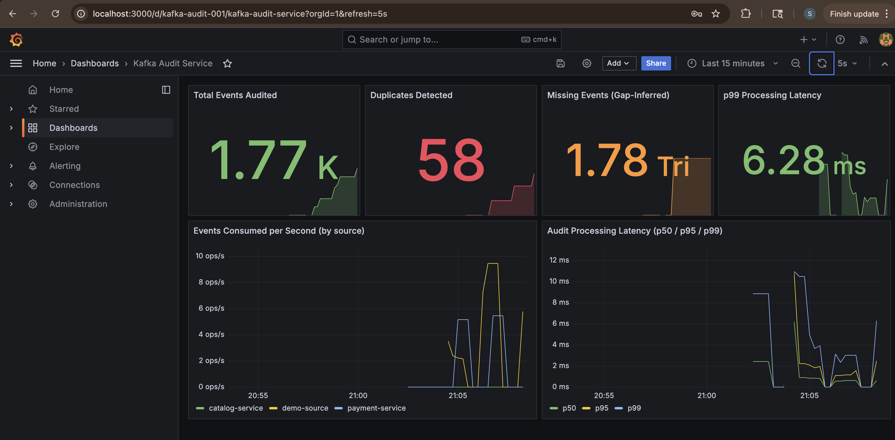

# Kafka Audit Service

> Production-style Kafka message audit service that detects message loss and duplicates across topics in real time using probabilistic data structures, with live Prometheus metrics and Grafana dashboards.

[](https://adoptium.net/)
[](https://spring.io/projects/spring-boot)
[](https://kafka.apache.org/)
[](https://docs.docker.com/compose/)



## What it does

The service consumes events from a Kafka topic and detects two classes of data-quality issues in real time:

1. **Duplicate messages** — using a Guava Bloom filter to track every `eventId` it has seen (~12 MB memory for 10M events at 1% false-positive rate)
2. **Missing messages** — by watching `sequenceNumber` gaps per event source

Detection results stream to Prometheus and visualize live in Grafana, so dropped or duplicate messages trigger alerts within seconds of occurring, instead of being found hours later in batch reconciliation.

## Why it exists

In high-throughput Kafka pipelines, transient failures (consumer rebalances, network blips, producer retries) routinely cause duplicates and silent message loss. Naive deduplication via a `HashSet` doesn't scale beyond a few million keys per JVM. This project uses a Bloom filter to track tens of millions of event IDs with constant memory and a tunable false-positive rate.

## Architecture
┌────────────┐    ┌─────────┐    ┌──────────────────┐    ┌────────────┐
│ Producer   │───▶│ Kafka   │───▶│ Audit Consumer   │───▶│ Prometheus │
│ Service    │    │ Topic   │    │ (Bloom + Seq)    │    │  + Grafana │
└────────────┘    └─────────┘    └──────────────────┘    └────────────┘
│
▼
REST: /audit/stats
## Tech stack

- **Java 17**, **Spring Boot 3.2**
- **Apache Kafka 3.6** (KRaft mode, no Zookeeper)
- **Spring Kafka** with `ErrorHandlingDeserializer` and `MANUAL_IMMEDIATE` ack mode for at-least-once semantics
- **Guava** Bloom filter for memory-efficient deduplication
- **Micrometer** + **Prometheus** + **Grafana** for observability
- **Docker Compose** for the full local stack (Kafka + Kafka UI + Prometheus + Grafana)

## Quick start

```bash
# Start the full stack: Kafka, Kafka UI, Prometheus, Grafana
docker compose -f docker/docker-compose.yml up -d

# Create the audit topic
docker exec -it kafka kafka-topics \
  --bootstrap-server localhost:9092 \
  --create --topic audit-events \
  --partitions 3 --replication-factor 1

# Run the service
mvn spring-boot:run

# Generate traffic with intentional duplicates
curl -X POST 'http://localhost:8080/inject/with-dups?count=100&dupRate=0.1'
```

Browse:
- **Grafana dashboard**: http://localhost:3000 → Dashboards → Kafka Audit Service
- **Prometheus**: http://localhost:9090
- **Kafka UI**: http://localhost:8090
- **Audit stats API**: http://localhost:8080/audit/stats
- **Raw metrics**: http://localhost:8080/actuator/prometheus

## Key design decisions

| Decision | Rationale |
|---|---|
| **`acks=all` + idempotent producer** | Eliminates duplicate writes from producer retries and guarantees durability across in-sync replicas |
| **`MANUAL_IMMEDIATE` ack mode** | Offsets commit only after successful processing — at-least-once semantics with maximum durability |
| **`ErrorHandlingDeserializer`** | Poison-pill messages (malformed JSON) are logged and skipped instead of crashing the consumer loop forever |
| **Partition key = event source** | Preserves per-source ordering while still allowing horizontal scaling across partitions |
| **Guava Bloom filter for dedup** | Sub-linear memory, constant-time lookup, configurable false-positive rate; 40× more memory-efficient than `HashSet<String>` for 10M keys |
| **`ConcurrentHashMap.compute()` for sequence tracking** | Atomic check-and-update without external locking; safe across the 3 consumer threads |

## API

| Endpoint | Description |
|---|---|
| `GET /audit/stats` | Overall counts: events checked, duplicates, missing, sources |
| `GET /audit/stats/bloom` | Bloom filter stats + current expected FPP |
| `POST /inject/burst?count=N` | Inject N clean events |
| `POST /inject/with-dups?count=N&dupRate=0.1` | Inject N events with controlled duplicate rate |
| `GET /actuator/prometheus` | Prometheus scrape endpoint |
| `GET /actuator/health` | Spring Boot health check |

## Custom metrics

| Metric | Type | Tags |
|---|---|---|
| `audit_events_consumed_total` | Counter | `source`, `partition` |
| `audit_duplicates_detected_total` | Counter | `source` |
| `audit_missing_events_total` | Counter | `source` |
| `audit_processing_duration_seconds` | Timer (histogram, p50/p95/p99) | — |

## Project status

- [x] Producer + consumer with at-least-once semantics
- [x] Poison-pill handling via `ErrorHandlingDeserializer`
- [x] Bloom-filter-based duplicate detection
- [x] Sequence gap detection per source
- [x] Prometheus metrics with percentile histograms
- [x] Grafana dashboard with auto-provisioned datasource
- [x] Event injection endpoints for demos and load testing
- [ ] Testcontainers-based integration test
- [ ] Chaos test mode (configurable failure injection)
- [ ] GitHub Actions CI (build + test on push)

## License

MIT
